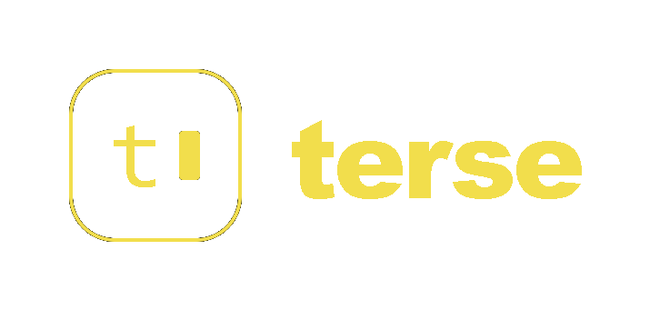

<div align="center">
  <picture>
    
  </picture>
</div>

<hr>

<div align="center" style="line-height: 1;">
  <a href="https://huggingface.co/MicheRomChis/micro-terse" target="_blank"></a>
  <a href="docs/papers/terse-micro-technical-report.md" target="_blank"></a>
  <a href="LICENSE"></a>
</div>

## 1. Model Introduction

**Micro-Terse** is a 423M-parameter (≈320M active) **ternary-weight** language model trained from
scratch in pure PyTorch on a single GPU. Its weights are constrained to `{-1, 0, +1}` (≈1.58 bits),
so the model quantizes **losslessly** to a **182 MB `TQ2_0` GGUF** that runs on a commodity CPU
with no GPU. The whole run — pretraining, SFT, and ORPO — cost about **$127**.

It is a research proof-of-concept, **not** a production assistant. At an 8B-token budget the model
is data-limited: fluent for a clause or two, near chance on knowledge benchmarks. The point is
**capability per megabyte and per joule** — a fully from-scratch ternary model an individual can
train and run on owned hardware.

### Key Features

- **Ternary weights `{-1, 0, +1}`** on all internal projections — matmuls reduce to add/subtract.
- **Clean-room architecture and ternary operator** — derived from, but not copied from, prior 1-bit work.
- **Lossless 182 MB GGUF** — `TQ2_0` packing is exact because the weights are already `{-1, 0, +1}`.
- **CPU-only inference** via a small `llama.cpp` fork (custom `terse` architecture).
- **Trained from scratch for ≈$127** on a single RTX A6000 (48 GB).

### Model Variants

| Variant | Stage | Best for |
|---|---|---|
| **terse-micro-base** | Pretrained LM | next-token prediction / completion |
| **terse-micro-sft** | Supervised fine-tuned | chat (most fluent) |
| **terse-micro-orpo** | ORPO-aligned | identity-aligned responses |

## 2. Architecture

Flow: `embed_tokens → 12× TerseBlock → final RMSNorm → tied LM head`, plus a multi-token-prediction
(MTP) head that predicts the token at position `+2` during training (dropped at inference). Each
`TerseBlock` is pre-norm residual attention followed by a dense or Mixture-of-Experts FFN.

| Property | Value |
|---|---|
| Total / active parameters | ≈423 M / ≈320 M (MoE top-2) |
| Layers / hidden | 12 / 1024 |
| Attention | GQA 8 query / 2 KV heads (4:1), head dim 128, QK-Norm before RoPE (θ=500000) |
| FFN | 2816 intermediate, squared-ReLU gated (~90% activation sparsity) |
| MoE | 4 experts, top-2, odd layers; aux-loss-free bias-EMA balancing |
| Ternary scope | Q/K/V/O, gate/up/down; embeddings, LM head, norms, router, biases stay full precision |
| Ternary operator | sign-with-threshold forward; FOGZO-shaped STE backward, learnable per-layer temperature |
| Context | 4096 |

Full rationale is in the [technical report](docs/papers/terse-micro-technical-report.md).

## 3. Evaluation

Standard academic benchmarks (MMLU/HellaSwag/ARC) were **not** run; at this data budget knowledge
accuracy is expected near chance. We report what we measured (see [`BENCHMARKS.md`](BENCHMARKS.md)):

- **Perplexity** (held-out English, lower better): base **56.7**, SFT 97.5, ORPO 125.0.
- **Identity preference** (mean log-prob margin, charter vs "ChatGPT", 4 probes): base **−1.81** → SFT −1.09 → ORPO **+0.90**.
- **Single-token factual recall** (base, top-1): "…painted by Leonardo da" → *Vinci* (90%), "…Neil" → *Armstrong* (84%), "hydrogen and" → *oxygen* (73%). ≈14/18 curated prompts correct.

## 4. Run Locally

The released GGUFs use a custom `terse` architecture, so they need the small `llama.cpp` fork
([branch `terse-arch`](https://github.com/michelangeloromerochisco/llama.cpp)):

```bash
# Download a GGUF from Hugging Face
huggingface-cli download MicheRomChis/micro-terse terse-micro-sft.TQ2_0.gguf --local-dir .

# Build the fork, then:
./llama-cli -m terse-micro-sft.TQ2_0.gguf -p "Hello" -n 128
```

Or serve a PyTorch checkpoint with the built-in OpenAI-compatible server:

```bash
python scripts/serve.py --config configs/micro-trained.yaml --checkpoint path/to/model.pt --port 8080
python scripts/chat.py            # terminal chat
python scripts/serve_ui.py --port 3333 --api http://127.0.0.1:8080   # browser UI at :3333
```

## 5. Reproduce

```bash
pip install -e ".[dev]"
pytest tests/ -v

# Full run on a pod (RTX A6000 48GB)
python scripts/prepare_data.py --output data/fineweb-8B.bin --tokens 8000000000
python scripts/train.py     --config configs/micro-trained.yaml --data data/fineweb-8B.bin
python scripts/train_sft.py  --config configs/micro-trained.yaml
python scripts/train_pref.py --config configs/micro-trained.yaml
python scripts/export.py     --config configs/micro-trained.yaml --checkpoint <ckpt> --out terse.gguf
```

Use **`configs/micro-trained.yaml`** (the as-trained 423M config that matches the released GGUFs).
`configs/micro.yaml` is an older 1.06B planning spec and does not match the trained weights. The
test suite uses a tiny config in `tests/conftest.py` so it runs on CPU in under a minute.

| Script | Purpose |
|---|---|
| `scripts/prepare_data.py` | Stream FineWeb-Edu, tokenize (Llama-3.1), write a flat `uint32` token binary |
| `scripts/train.py` | Pretraining entry point |
| `scripts/train_sft.py` | Supervised fine-tuning (ChatML, prompt-masked loss) |
| `scripts/train_pref.py` | ORPO preference alignment |
| `scripts/eval.py` | lm-eval-harness suite against a checkpoint |
| `scripts/export.py` | Export a checkpoint to GGUF with ternary packing |
| `scripts/serve.py` | OpenAI-compatible chat server |

## 6. License

Apache-2.0. See [`LICENSE`](LICENSE).

## 7. Citation

```bibtex
@techreport{romerochisco2026tersemicro,
  title  = {Terse-Micro: A 423M-Parameter Ternary-Weight Language Model Trained From Scratch for \$127},
  author = {Romero Chisco, Michelangelo},
  year   = {2026},
  note   = {Apache-2.0. github.com/michelangeloromerochisco/micro-terse}
}
```
